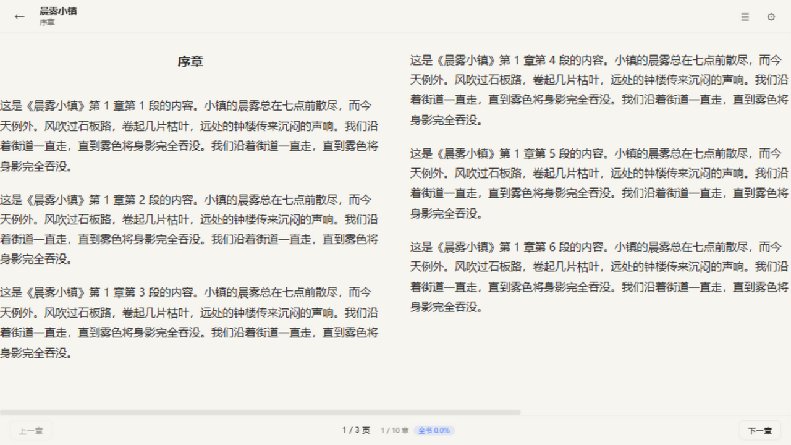
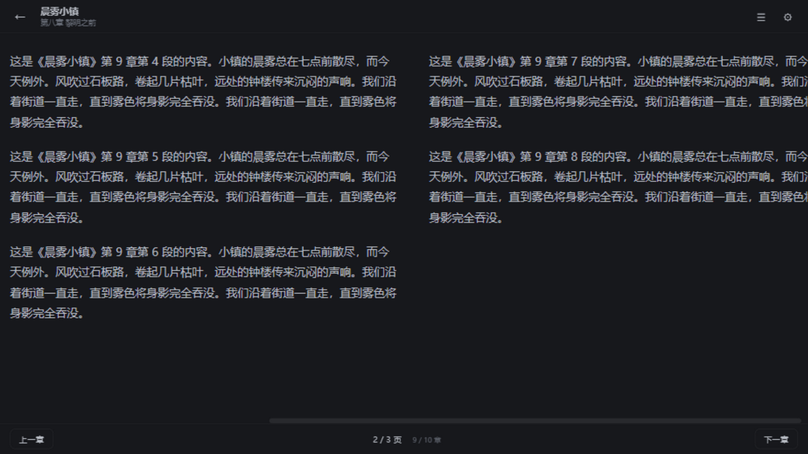

# 📖 轻阅 QingYue

一个开源的**小说阅读器**（Web），纯本地运行：导入 TXT / EPUB，即开即读。

> 书籍与进度只保存在你自己的浏览器（IndexedDB）里，不上传任何数据。

> **v1.1.0**：阅读助手全面打磨、阅读器翻页与位置记忆增强、EPUB CSS/内嵌字体排版还原、在线书缓存章节知识库、全书搜索、阅读日历和单书导出/导入。

## 🚀 立即使用（不用下载）

**轻阅是网页应用，不需要安装，打开链接就能用：**

<p align="center">
  <a href="https://skyyapa.github.io/qingyue/"></a>
  <a href="https://github.com/skyyapa/qingyue/releases/latest"></a>
</p>

**三种用法，选一个：**

| 方式 | 适合谁 | 怎么做 |
| --- | --- | --- |
| 🌐 **在线使用** | 大多数人 | 点上方「在线打开轻阅」，浏览器直接用，数据存本机 |
| 📱 **装到桌面** | 想像普通 App 一样用 | 打开在线版后，点页面底部「安装」按钮（手机 iOS 用 Safari「分享 → 添加到主屏幕」） |
| ⬇️ **下载离线版** | 想真正"下载"到电脑 | 下载上方「离线版」zip → 解压 → **双击 index.html** 就能用，断网也能读本地书 |

## ✨ 功能特性

- **本地导入阅读** — 支持 TXT / EPUB 格式，点击选择或直接拖拽，可多选批量导入；超大文件带进度条，单文件上限 200MB
- **中文编码自动识别** — UTF-8 / GB18030（兼容 GBK）/ Big5 / UTF-16（含无 BOM）自动判别，识别不了时可手动指定编码
- **EPUB 支持** — NCX / EPUB3 nav 目录解析（章节标题更准确）、正文内嵌图片显示、章节内小标题保留；**排版还原**：内嵌 CSS 段落样式（首行缩进 / 对齐 / 行距 / 字号 / 颜色 / 粗斜体 / 下划线）+ @font-face 内嵌字体；自动跳过损坏章节与图片/样式类条目，对扫描版等无正文电子书给出友好提示
- **数据备份** — 一键导出全部书籍 / 章节 / 分组 / 阅读统计为单个文件（大文件自动 gzip），支持合并式恢复；**单书导出**：书架卡片菜单可把一本书（正文 + 进度 + 知识库）导出为 `.qingyue` 文件，迁移设备或分享，导入对话框直接恢复
- **阅读助手（本地知识库）** —
  - 无 AI 成本：基于上下文规则的实体识别（如「X说」→ 人物、「在X」→ 地点、「使出X」→ 技能、「突破X / X境」→ 境界），覆盖**人物 / 地点 / 势力 / 技能 / 物品 / 境界**六类，建立全书章节索引；规则识别**可能误判**，所有实体都支持人工修正
  - **事件时间线**：章节事件句（「A 对 B 说」）跨章自动聚合，按时间线浏览全书事件，点击直达原文
  - 人物关系图（段落共现加权）、章节摘要（登场人物 / 地点 / 事件句）、前情回顾（时间线可点击跳章）
  - **正文内定位**：例句一键「定位」跳回原文、出现章节点击直达该章实体首次出现处（锚点高亮）
  - 人物 / 设定 / 章节列表支持搜索过滤；重分析时**别名自动参与匹配**（合并过的实体知识不丢失），不再出现的实体自动清理
  - 选中正文文字一键查角色，未识别的可「加入知识库」
  - 实体卡片：出现章节跳转、共现关系、例句；支持改名 / 合并 / 删除 / 备注（人工修正兜底）
  - AI 语义能力（剧情解释等）已预留 Provider 接口，后续接入
- **在线书源引擎** —
  - legado 风格书源规则（搜索 / 目录 / 正文 CSS 选择器 + 模板变量 + 管道处理）
  - **分页目录 / 正文分页**：规则声明「下一页」链接选择器，自动跨页抓取（防循环 + 页数上限）
  - **规则分享**：单书源一键生成分享链接（打开即进入导入页）或复制 JSON；支持批量导入（粘贴 / JSON 文件，可选覆盖同 ID 书源）
  - 书架搜索框直接在线搜书，一键加入书架；正文按需抓取并缓存，离线可续读；**在线书同样支持知识库分析**（基于已缓存章节）
  - 跨域三通道：项目自带代理（Cloudflare Worker / Node 双版本）/ 自备代理 / 公共代理兜底
  - 书源管理：编辑 JSON、启停、搜索测试、导入导出；内置「轻阅演示」书源开箱即用（含分页目录与分页正文示例）
- **AI 阅读助手（可选接入）** — 书架顶栏「AI」统一配置 Provider：OpenAI 兼容（DeepSeek / Gemini / 本地 Ollama / LM Studio / 自定义 API），Base URL + API Key + Model + 一键测试连接；API Key 仅保存在本机。配置后阅读助手中可用：**这是谁 / 前情回顾 / 剧情解释 / 人物关系 / 世界观解释 / 事件时间线 / 自由提问**，选中正文文字一键「✨ AI」带入提问
- **PWA 可安装** — 一键「安装到桌面」像普通软件一样使用（含 iOS 添加到主屏幕指引），离线可读已缓存内容与本地书籍
- **智能章节切分** — 自动识别「第X章 / 第X回 / 序章 / 楔子 / 番外 / 终章」等章节标题，书名作者自动提取；无章节标记的整本单章兜底
- **书架管理** —
  - 自定义分组（新建 / 删除分组，书籍一键归类）；卡片菜单可一键「重置阅读进度」重读
  - 排序：最近阅读 / 最近导入 / 书名 / 手动拖拽排序
  - 按书名 / 作者即时搜索过滤
  - 生成式封面、一键删除（应用内确认对话框）
- **阅读占比** — 全书已读百分比按字数加权计算，书架卡片与阅读器底部实时显示
- **阅读统计** — 今日阅读时长、连续阅读天数、累计时长（仅保存在本机；挂机 60 秒无操作自动停止计时）；**阅读日历**：📊 查看月度阅读热力图（颜色越深读得越久）
- **沉浸阅读体验** —
  - 字号 / 行距 / 字体（系统·宋体·黑体·楷体·衬线）自由调节；阅读器底栏 **A− / A+ 快捷调字号**，设置面板可一键恢复默认
  - 十套主题皮肤：默认 / 极简白 / 羊皮纸 / 青瓷 / 护眼 / 樱花粉 / 夜间 / 深蓝 / 墨绿 / 石墨
  - 拟真书页效果：正文渲染成带纸张质感与书页阴影的「纸页」（可一键关闭）
  - 两种翻页方式：连续滚动 / 翻页（分栏排版）；翻页模式支持**方向键翻页（到页尾自动翻章）**、**触屏左右滑动翻页**、章末「下一章」入口与「全书完」标记
  - **阅读位置记忆**：上一章 / 下一章 / 目录往返自动回到之前的位置，不再总从头开始
  - **正文搜索**：`Ctrl+F`（或顶栏 🔍）支持「本章」逐处高亮跳转（↑/↓ 或 Enter 切换）和「本书」跨章节搜索；在线书搜索已缓存章节并明确显示扫描范围，点击结果直达原文高亮处
  - 目录抽屉，点击任意章节跳转（打开即定位到当前章）
- **进度自动保存** — 阅读位置防抖写入 IndexedDB，刷新 / 重开浏览器无缝续读；页面被强杀前也会兜底保存
- **快捷键** — `←` / `→` 翻页或翻章，`Ctrl+F` 章节内搜索，`Esc` 关闭所有面板（目录 / 设置 / 助手 / 搜索）

## 🖼️ 截图

| 书架 | 日间阅读 | 夜间阅读 | 阅读助手 |
| --- | --- | --- | --- |
|  |  |  |  |

## 🚀 本地开发

```bash
npm install        # 安装依赖
npm run dev        # 启动开发服务器（http://localhost:5173）
npm run build      # 类型检查 + 生产构建（输出 dist/）
npm run preview    # 预览构建产物
```

## ✅ 质量保障

```bash
npm run lint       # ESLint 代码检查
npm run type-check # TypeScript 类型检查
npm run test       # 单元测试（Vitest，145 用例：编码检测/EPUB 与 CSS 解析/知识库算法/书源引擎/AI 客户端与任务/数据库/Store/组件/备份/导出/搜索）
npm run e2e        # 端到端测试（Playwright 29 用例，首次需 npx playwright install chromium）
```

GitHub Actions 自动运行：推送到 `main` 或发起 PR 时执行 CI（lint + type-check + 单测 + 构建 + E2E），部署前自动验证。

[](https://github.com/skyyapa/qingyue/actions/workflows/ci.yml)

## 🛠️ 技术栈

- **Vue 3**（`<script setup>`）+ **TypeScript** + **Vite**
- **vue-router** / **Pinia** 状态管理
- **IndexedDB**（原生封装，零依赖）存储书籍与进度
- **jszip** 解析 EPUB；手写 CSS 变量主题系统，无 UI 组件库

## 📁 项目结构

```
src/
├── db/          # IndexedDB 封装（books/chapters/entities/chapterIndex/relations/bookFonts 六 store）
├── parsers/     # TXT（编码检测+章节切分）与 EPUB 解析器（含 CSS 子集排版解析）
├── analyze/     # 无 AI 知识库管线（新词发现 / 上下文分类 / 事件提取）
├── book-source/ # 在线书源引擎（规则模板 / 抓取 / 代理 / 分享导入）
├── stores/      # Pinia：书架 / 阅读设置 / 阅读统计 / 阅读器 / 知识库操作
├── ai/          # AI Provider 接口契约（预留，未接入）
├── utils/       # 阅读占比、时长格式化、备份等工具
├── views/       # BookshelfView 书架、ReaderView 阅读器
├── components/  # 导入对话框、目录/设置/助手面板、实体卡片、关系图等
└── styles/      # 全局样式与十套主题变量
```

## 🚢 部署到 GitHub Pages

使用 hash 路由（`#/reader/xxx`），在任何静态托管下刷新深链接都不会 404。

仓库已内置 GitHub Actions 工作流（`.github/workflows/deploy-pages.yml`）：推送到 `main` 分支后自动构建并部署。

首次部署需在仓库 **Settings → Pages** 中把 Source 设为 **GitHub Actions**。若仓库改名，记得同步修改工作流里的 `--base=/qingyue/` 为 `--base=/新仓库名/`。

线上地址：<https://skyyapa.github.io/qingyue/>

## 🔌 部署书源代理

小说网站通常禁止浏览器跨域访问，在线书源需要代理转发（「书源管理 → 代理设置」中配置）：

**Cloudflare Workers（推荐，免费）**
1. 打开 <https://dash.cloudflare.com> → Workers & Pages → 创建 Worker
2. 粘贴 [proxy/worker.js](proxy/worker.js) 的内容 → 部署
3. 把生成的 `https://xxx.workers.dev/` 填入「自备代理」地址

**Node（本地 / 自建服务器）**
```bash
node proxy/server.mjs   # 默认 8787 端口
# 把 http://你的地址:8787/ 填入「自备代理」地址
```

也可直接使用内置「公共代理」模式（稳定性不保证）。

## 🗺️ 路线图

- [ ] **AI 语义能力接入**（剧情解释 / 语义摘要 / 世界观描述）——知识库数据已就绪，Provider 接口已预留
- [ ] 语义级事件提取（「三年之约」类剧情事件）——需 LLM，v1 用章节实体快照与事件句替代
- [ ] 书源规则分享社区 / 规则包市场（当前已支持链接分享与批量导入）
- [x] ~~EPUB 排版还原~~（内嵌 CSS 段落样式 + 行内粗斜体 + @font-face 内嵌字体，已完成）
- [ ] 演示 GIF

## 🤝 贡献

欢迎提交 Issue 和 PR！提交前请先通过质量检查：

```bash
npm run lint && npm run type-check && npm run test
```

## 📄 License

[MIT](LICENSE) © 2026 轻阅 (QingYue) contributors
